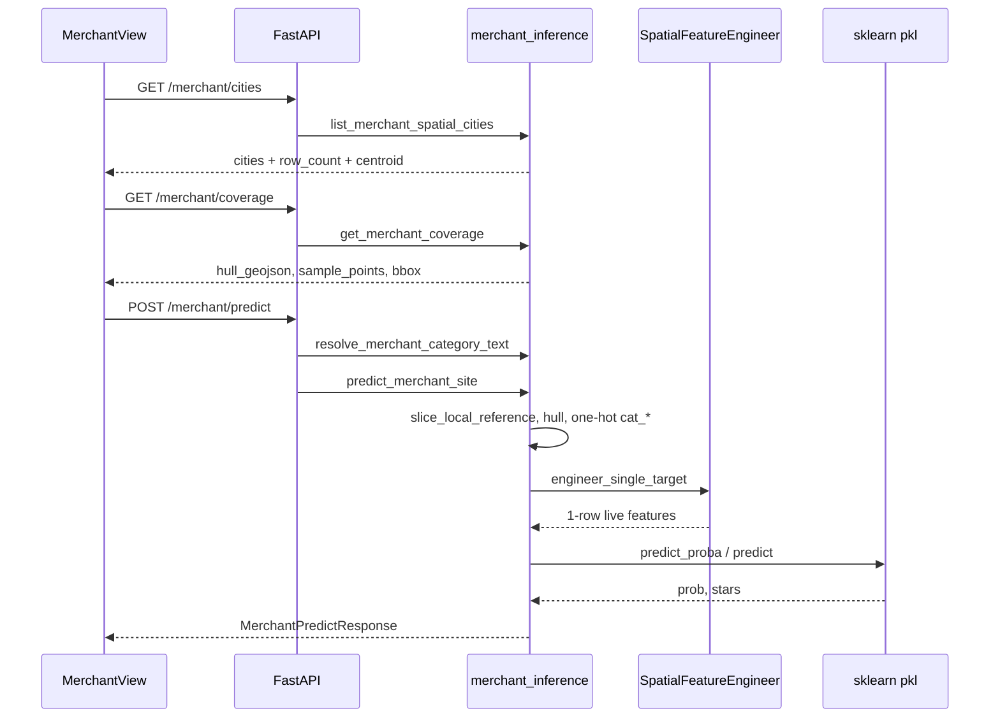

# Merchant site predictor — algorithms and flow

This document covers the end-to-end **Merchant site predictor** (`/merchant`): data, HTTP API, `predict_merchant_site` order of operations, and how it ties to `SpatialFeatureEngineer` and the saved models.

| Entry | Path |
|------|------|
| UI | `frontend/src/views/MerchantView.vue` |
| API routes | `backend/api/main.py` |
| Predict + slicing | `backend/services/merchant_inference.py` |
| Neighborhood features | `pipelines/spatial_feature_engineer.py` (`engineer_single_target` / `compute_local_features`) |
| Request/response | `backend/api/schemas.py` (`MerchantPredictRequest`, etc.) |

---

## 1. Goals and outputs

Given **city/state**, **map pin (lat, lon)**, and **plain-language business type** (or explicit `cat_*`), the system returns:

| Field | Meaning |
|------|---------|
| `survival_probability` | Binary “still open” probability (0–1) |
| `predicted_stars` | Regressor output |
| `inside_reference_hull` | Whether the query lies in the **convex hull** of training reference points (outside = extrapolation) |
| `resolved_category_keys` | `cat_*` columns used for this run |

The API may also return `reference_row_count`, `live_feature_preview`, `metrics`, etc.; the merchant UI may hide them to avoid debug noise.

---

## 2. Data and runtime

| Resource | Role |
|------|------|
| `data/train_spatial.csv` or `train_spatial.csv` at repo root | Spatial reference: lat/lon, `city`, `state`, `cat_*`, `stars`, `is_open`, …; used for slices, map coverage, neighborhood stats. |
| `SPATIAL_CITY_MIN_TRAIN_ROWS` (**50**, synced with `frontend/src/api/client.ts`) | Min rows per normalized `(city, state)` in `train_spatial` to appear in the cities API. |
| `models/artifacts/global_survival_model.pkl` | sklearn classifier; columns must match `feature_names_in_`. |
| `models/artifacts/global_rating_model.pkl` | sklearn regressor. |
| `GET /api/health` | Checks `spatial_csv`, `survival_pkl`, `rating_pkl`. |

**City key normalization**: `_city_group_key_spatial` (collapse spaces, Unicode NFKC, `casefold`) so CSV labels line up with the UI and slices are non-empty.

---

## 3. End-to-end sequence (sketch)



---

## 4. Front-end behavior (`MerchantView.vue`)

1. **onMounted**: `getMerchantCities({ min_rows: SPATIAL_CITY_MIN_TRAIN_ROWS })`; URL `?city=&state=` sync.
2. **initMap**: OSM; map **click** updates `lat/lon`, draws pin, **380ms debounce** → `run()` (needs business-type text).
3. **watch(city, maxRows, stateFilter)**: `getMerchantCoverage` refresh hull + sample dots, `fitBounds` to slice.
4. **run()**: `postMerchantPredict` with `category_query`, `city/state/lat/lon`, `max_rows_if_no_city`; opens result panel.

### 4.1 Parameter mapping

| UI | API field | Notes |
|----|-----------|-------|
| City, state | `city`, `state` | Match `train_spatial` after normalization; `state` uppercase USPS. |
| Map pin | `lat`, `lon` | WGS84. |
| Type text | `category_query` | Comma-separated NL; server resolves `cat_*`. |
| Max rows (sidebar) | `max_rows_if_no_city` | When no city name, caps reference head; with city, slice dominates. |

---

## 5. HTTP API notes

### 5.1 `POST /api/v1/merchant/predict`

- **Body** (`MerchantPredictRequest`): `lat` / `lon` required; `category_query` and/or `category_keys` (routing usually prefers text → `cat_*`).
- **Success**: `MerchantPredictResponse`.
- **Errors**:
  - `503`: missing `train_spatial.csv` or model files.
  - `400`: `category_query` does not map to `cat_*` in slice; bad column names; or `ValueError` in predict (e.g. &lt; 10 reference rows).

### 5.2 `GET /api/v1/merchant/cities`

- Query: `min_rows` — effective value is `max(request, SPATIAL_CITY_MIN_TRAIN_ROWS)`.

### 5.3 `GET /api/v1/merchant/coverage`

- Same `slice_local_reference` as predict; returns `hull_geojson`, sample points, bbox, centroid. If the hull is degenerate, a **bbox polygon** is used so the map still shows extent.

### 5.4 Other

- `GET /api/v1/merchant/categories`, `/merchant/categories/resolve`: list or resolve `cat_*` in the current slice (debug / future UI).

---

## 6. Core prediction: `predict_merchant_site`

**File**: `backend/services/merchant_inference.py`.

### 6.1 Reference slice

1. `load_spatial_reference` loads the table.
2. `slice_local_reference`: filter by normalized city + state.
3. If `len(local_ref) < 10` → error, no prediction.
4. **ConvexHull** on reference points; ray-casting for `inside_reference_hull`.
5. If hull fails but points exist, coverage can still use a **bbox** (predict still uses hull vs point when possible).

### 6.2 One-hot intent

- All `cat_*` in the slice.
- Resolved columns set to 1, else 0; aligned with model `feature_names_in_` intersection.

### 6.3 `engineer_single_target`

**File**: `pipelines/spatial_feature_engineer.py`.

- Radians, **BallTree (haversine)**, ~**3 km** neighbor radius.
- Ring stats at **0.5 / 1.0 / 3.0 km**: counts, same-category, ratings, survival, diversity, ratios, gaps vs global/local, …
- **KNNRetrievalEngine** on `cat_*` for top-K similar venues → `avg_rating_top5_similar`, `survival_top5_similar`, etc.
- Single-row `DataFrame` for model column alignment.

### 6.4 Training column alignment

- `_augment_live_for_model_columns` maps legacy names (e.g. `local_restaurant_count`) to current columns (e.g. `count_all_3.0km`), then fills `survival_model.feature_names_in_` / `rating_model.feature_names_in_` to avoid **silent all-zero** rows.

### 6.5 Two models

- **Survival**: `predict_proba` positive class → `survival_probability`.
- **Rating**: `predict` → `predicted_stars`.

### 6.6 Extras

- `metrics`: a few keys from the live row.
- `live_feature_preview`: up to ~32 numeric features for debugging; UI may hide.

---

## 7. Boundary vs tourist search

- **Merchant** does not build a TF-IDF index; it uses `train_spatial` + global `pkl` files.
- **Tourist** (`/search`) uses `business_dining` + the search index — **different data path**; do not treat as one “full” dataset.
- See `dining_retrieval`, `retrieval_service`, and other docs.

---

## 8. Ops and troubleshooting

- Short city list: ensure `train_spatial` is extracted, **rows ≥ 50** where expected, keys match data.
- “&lt; 10 reference rows”: thin slice — add data or pick another city.
- No hull: check `/merchant/coverage` `hull_geojson` / `geo_count`; `state` must match CSV.
- Constant model outputs: verify `feature_names_in_` vs `legacy_map`.

---

## Appendix A: Product add-ons (implemented — rules + API + UI)

Rule layer in **`predict_merchant_site`** over the reference slice. Request: `price_level` (1–4) or `price_per_person`. Response: `price_fit`, `price_gap`, `nearby_avg_price_level`, `risk`, `explanation`, `business_score`. OpenAPI and `MerchantView` stay in sync.

| Area | Content |
|------|---------|
| Price | User tier or $/person vs mean training price tier within 1 km → `price_gap`, `price_fit`. |
| Risk | `risk` map: competition, location, price — rule labels (e.g. high/medium/low). |
| Narrative | `explanation` short English summary. |
| Composite | `business_score` 0–100 from survival, stars, price match, risk. |

Training is still from `merchant_predictor` survival/rating `pkl`; this layer is **post-hoc rules**, not a new trained head.

---

## Appendix B: File quick reference

```
backend/api/main.py                 # routes
backend/api/schemas.py              # Pydantic models
backend/services/merchant_inference.py  # slice, hull, predict, coverage, cities
pipelines/spatial_feature_engineer.py   # BallTree + multi-ring features
frontend/src/api/client.ts          # SPATIAL_CITY_MIN_TRAIN_ROWS, HTTP helpers
frontend/src/views/MerchantView.vue     # map + predict UI
```
